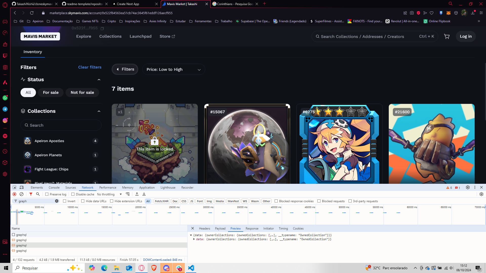

# Wallet-NFTDex


> Projeto simples para testes na API utilizada no https://marketplace.skymavis.com

## 💻 Pré-requisitos

Antes de começar, verifique se você atendeu aos seguintes requisitos:

- Você instalou a versão mais recente de `Node.js, React, Next.js, Typescript`
- Você tem uma máquina `<Windows / Linux / Mac>`.

## 🚀 Instalando Wallet-NFTDex

Para instalar o Wallet-NFTDex, siga estas etapas:

Linux e macOS:

```
npm run install
```

Windows:

```
npm run install
```

## ☕ Usando Wallet-NFTDex

Para usar Wallet-NFTDex, siga estas etapas:

```
npm run dev
```

## 📊 Relatório de uso

Eu notei que no site da SkyMavis ao entrar com um endereço ele faz três requisições: 
- Uma para pegar informações do usuário como nickname, avatar, etc.
- Informações sobre os collections que esse usuário possui e a quantidade de nft separado (esse consegui puxar as info, apesar de não ter conseguido puxar as imagens de capa do collection)
- Listagem geral dos nfts que o usuário possui



### APIs que utilizei para replicar essa tela:
1. [Get list of collections having NFTs belonging to an address (GET)](https://docs.skymavis.com/api/web3/get-list-of-collections-having-nf-ts-belonging-to-an-address)
2. [Search for matched NFTs](https://docs.skymavis.com/api/ronin-rest/search-for-matched-nf-ts)

#### Considerações: Para pegar os collections do usuário eu precisei somente do endereço da carteira, e consegui pegar normalmente todas as informações separadas de collections. 
#### Já para pegar os nfts do usuário eu precisei do endereço da carteira e apesar de ser required o `contractAddresses` você pode passar um array vazio que ele retorna todos os nfts do usuário.


