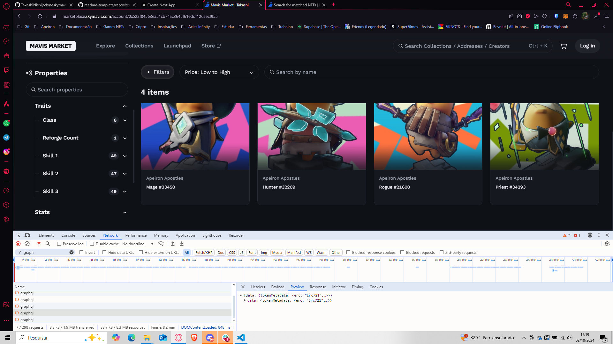
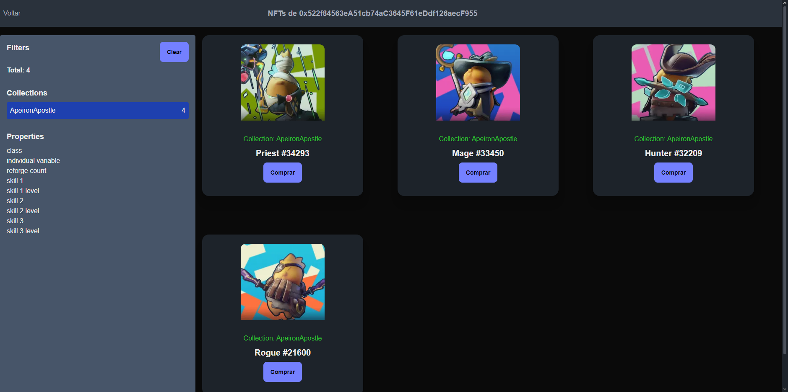

# Wallet-NFTDex


> Projeto simples para testes na API utilizada no https://marketplace.skymavis.com

## 💻 Pré-requisitos

Antes de começar, verifique se você atendeu aos seguintes requisitos:

- Você instalou a versão mais recente de `Node.js, React, Next.js, Typescript`
- Você tem uma máquina `<Windows / Linux / Mac>`.

## 🚀 Instalando Wallet-NFTDex

Para instalar o Wallet-NFTDex, siga estas etapas:

Linux e macOS:

```
npm run install
```

Windows:

```
npm run install
```

## ☕ Usando Wallet-NFTDex

Para usar Wallet-NFTDex, siga estas etapas:

```
npm run dev
```

## 📊 Relatório de uso

Eu notei que no site da SkyMavis ao entrar com um endereço ele faz três requisições: 
- Uma para pegar informações do usuário como nickname, avatar, etc.
- Informações sobre os collections que esse usuário possui e a quantidade de nft separado (esse consegui puxar as info, apesar de não ter conseguido puxar as imagens de capa do collection)
- Listagem geral dos nfts que o usuário possui


### APIs que utilizei para replicar essa tela:
1. [Get list of collections having NFTs belonging to an address (GET)](https://docs.skymavis.com/api/web3/get-list-of-collections-having-nf-ts-belonging-to-an-address)
2. [Search for matched NFTs](https://docs.skymavis.com/api/ronin-rest/search-for-matched-nf-ts)

#### Considerações: Para pegar os collections do usuário eu precisei somente do endereço da carteira, e consegui pegar normalmente todas as informações separadas de collections. 
#### Já para pegar os nfts do usuário eu precisei do endereço da carteira e apesar de ser required o `contractAddresses` você pode passar um array vazio que ele retorna todos os nfts do usuário.


### Filtro por collections


Ao selecionar uma coleção, notei que o site faz duas novas requisições:
- Ele filtra os nfts do usuário pelo endereço do contrato da coleção selecionada
- Faz uma requisição de tokenMetadata, onde vem os filtros especificos dessa coleção (Por exemplo o da imagem acima temos informações como `class` e `skils`)

### APIs que utilizei para replicar essa tela:
A partir daqui eu não consegui replicar as requisições que o site faz utilizado a API REST da SkyMavis, então eu utilizei a API GraphQL que eles disponibilizam para pegar as informações de tokenMetadata.

Nisso vem exatamente os mesmos filtros que o site utiliza, porém ele não tem uma opção de sort ou agrupamento, acredito que essa parte é algo que a equipe de desenvolvimento do site faz especifico para cada jogo da plataforma.

- Query que utilizei para pegar as informações de tokenMetadata:
```graphql
 query GetTokenMetadata($tokenAddress: String!) {
            tokenMetadata(tokenAddress: $tokenAddress) {
              attributes {
                displayType
                key
                values {
                  value
                  count
                }
              }
            }
          }
```

> Já para pegar as informações de nfts do usuário eu utilizei a mesma API REST que utilizei anteriormente, apenas adicionei o filtro de `contractAddresses` com o endereço do contrato da coleção selecionada dentro do array.



## 🔎 Considerações

Existe uma diferença entre a API REST e a API GraphQL da SkyMavis, a API REST é mais simples e direta, porém não tem todas as informações que a API GraphQL tem, por exemplo, pegar os metadatas de uma coleção específica, e também ao listar os NFTs acredito que preciso trocar para o GraphQL pois os filtros por metadatas só estão disponíveis nessa API.

Suspeito que as informações de Axie também está em outra API no playground deles tem algo separado para Axie, logo, notei que algumas informações desse jogo não vem igual os outros games, como por exemplo as propriedades de alguma coleção de Axie.